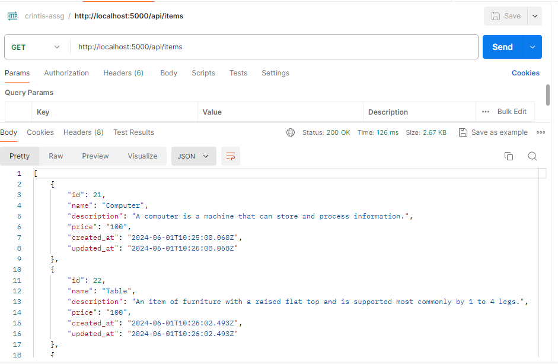
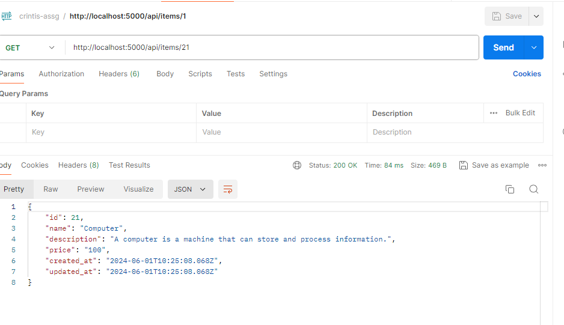
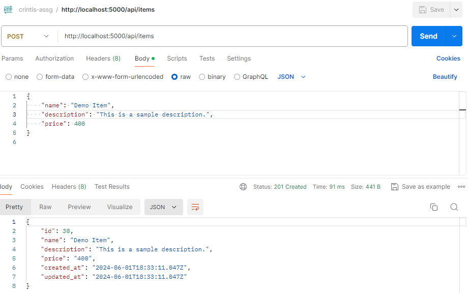
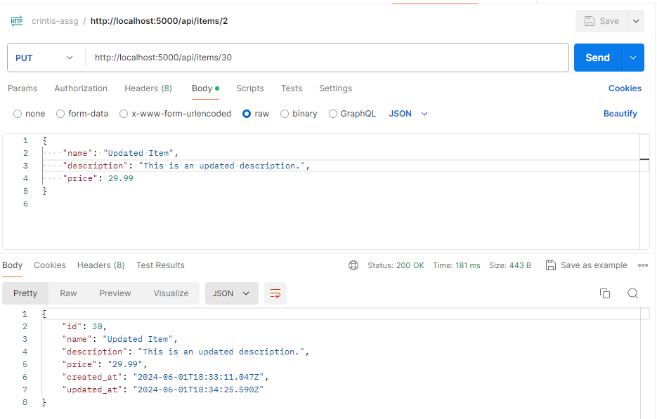
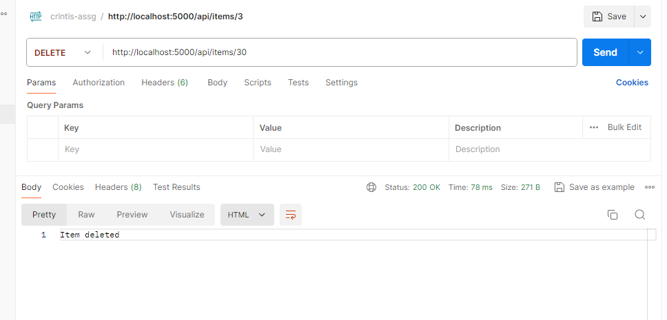

# Inventory Management Backend

This project is a simple CRUD (Create, Read, Update, Delete) API for managing items. It is built using Node.js, Express, and PostgreSQL.

## Snapshots

- **Get All Items:**



- **Get Item by Id:**



- **Add new Item:**



- **Update Item:**



- **Delete Item:**



## Features

- Retrieve all items
- Retrieve a single item by ID
- Create a new item
- Update an existing item by ID
- Delete an item by ID

## Prerequisites

- Node.js
- PostgreSQL

## Installation

To run this project locally, follow these steps:

1. Clone the repository.
2. Navigate to the project directory:

```
cd crinitis-assg-backend
```

3. Install the necessary dependencies:

```
npm install
```

4. Create a .env file in the root directory and add your database configuration:

```
DB_USER=your_db_user
DB_HOST=your_db_host
DB_NAME=your_db_name
DB_PASSWORD=your_db_password
DB_PORT=your_db_port
```

5. Run the project.

```
npm start
```

6. The server will run on `http://localhost:5000`

## API Endpoints

### Get All Items

- **URL:** `/api/items`
- **Method:** `GET`
- **Description:** Retrieves a list of all items.
- **Success Response:**
  - **Code:** 200
  - **Content:** An array of item objects
    ```json
    [
      {
        "id": 1,
        "name": "Item Name",
        "description": "Item Description",
        "price": 9.99,
        "updated_at": "2023-06-01T00:00:00.000Z"
      },
      ...
    ]
    ```

### Get Item By ID

- **URL:** `/api/items/:id`
- **Method:** `GET`
- **URL Params:**
  - `id` - ID of the item
- **Description:** Retrieves a specific item by its ID.
- **Success Response:**
  - **Code:** 200
  - **Content:** An item object
    ```json
    {
      "id": 1,
      "name": "Item Name",
      "description": "Item Description",
      "price": 9.99,
      "updated_at": "2023-06-01T00:00:00.000Z"
    }
    ```
- **Error Response:**
  - **Code:** 404
  - **Content:** `Item not found`

### Create Item

- **URL:** `/api/items`
- **Method:** `POST`
- **Description:** Creates a new item.
- **Data Params:**
  - `name` (string) - Name of the item
  - `description` (string) - Description of the item
  - `price` (number) - Price of the item
- **Success Response:**
  - **Code:** 201
  - **Content:** The created item object
    ```json
    {
      "id": 1,
      "name": "Item Name",
      "description": "Item Description",
      "price": 9.99,
      "updated_at": "2023-06-01T00:00:00.000Z"
    }
    ```
- **Error Response:**
  - **Code:** 500
  - **Content:** `Server Error`

### Update Item

- **URL:** `/api/items/:id`
- **Method:** `PUT`
- **URL Params:**
  - `id` - ID of the item
- **Description:** Updates an existing item by its ID.
- **Data Params:**
  - `name` (string) - Name of the item
  - `description` (string) - Description of the item
  - `price` (number) - Price of the item
- **Success Response:**
  - **Code:** 200
  - **Content:** The updated item object
    ```json
    {
      "id": 1,
      "name": "Updated Item Name",
      "description": "Updated Item Description",
      "price": 19.99,
      "updated_at": "2023-06-01T00:00:00.000Z"
    }
    ```
- **Error Response:**
  - **Code:** 404
  - **Content:** `Item not found`
  - **Code:** 500
  - **Content:** `Server Error`

### Delete Item

- **URL:** `/api/items/:id`
- **Method:** `DELETE`
- **URL Params:**
  - `id` - ID of the item
- **Description:** Deletes an item by its ID.
- **Success Response:**
  - **Code:** 200
  - **Content:** `Item deleted`
- **Error Response:**
  - **Code:** 404
  - **Content:** `Item not found`
  - **Code:** 500
  - **Content:** `Server Error`

## Technologies Used

- **Node.js**: JavaScript runtime for building server-side applications
- **Express**: Web framework for Node.js
- **PostgreSQL**: Relational database management system
- **pg**: PostgreSQL client for Node.js
- **dotenv**: Module for loading environment variables from a .env file
- **cors**: Middleware for enabling Cross-Origin Resource Sharing
- **body-parser**: Middleware for parsing incoming request bodies

## Authors

- [@Snehal](https://github.com/Snehal-Salvi)
